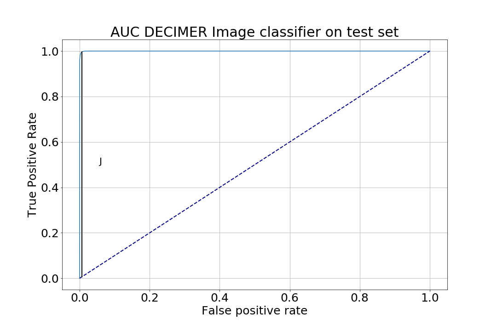

# DECIMER Image Classifier
[](https://opensource.org/licenses/MIt)
[](https://GitHub.com/iagea/DECIMER-Image-Classifier/graphs/commit-activity)
[](https://GitHub.com/iagea/DECIMER-Image-Classifier/issues/)
[](https://GitHub.com/iagea/DECIMER-Image-Classifier/graphs/contributors/)
[](https://doi.org/10.5281/zenodo.6670746)

This model's aim is to classify whether or not an image is a chemical structure or not. It was built using EfficientNetB0 as a base model, using transfer learning and fine tuning it.

It gives a prediction between 0 and 1 where 0 means it is a chemical structure and 1 means it is not. The data used to build the model is available in Zenodo. 

## Performance

The model was trained on 10905114 images, validated on 2179798 images and tested on 544946 images. It took 52h and 15 minutes and 17GB on a Tesla V100-PCIE-32GB GPU.

From the results on the test set, we computed the AUC and the Youden index (on the image below). Using the prediction threshold marked by the Youden index, **0.000089**, we achieved the following performance metrics:

<p align="center"> MCC = 0.989944</p>
<p align="center">Accuracy = 0.994968</p>
<p align="center">Sensitivity = 0.993049</p>
<p align="center">Specificity = 0.996888</p>



## Model construction

The model construction script is available on the **model_construction** folder with comments for every step taken.

## Installation
- Simply run 
`pip install git+https://github.com/Iagea/DECIMER-Image-Classifier`

## Usage
```
from decimer_image_classifier import DecimerImageClassifier

# Instantiate DecimerImageClassifier (this loads the model and all needed settings)
decimer_classifier = DecimerImageClassifier()

# If you just need a statement about the image at image_path being a chemical structure or not:
result = decimer_classifier.is_chemical_structure(image_path)

# If you want the classification score (value between 0 (-> chemical structure) and 1 (-> no chemical structure))
score = decimer_classifier.get_classifier_score(image_path)
```

## Example

An example with 10 images from the test set that will be available in Zenodo as well is present in the form of a Jupyter notebook on the folder **examples**.

